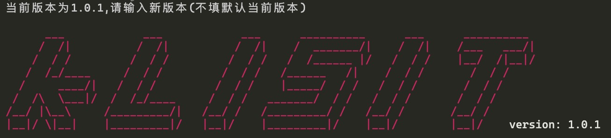
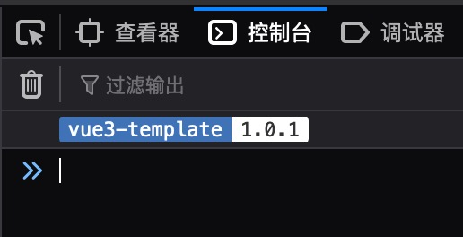
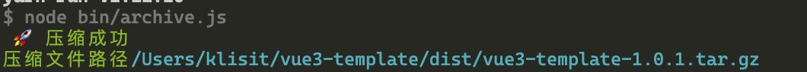
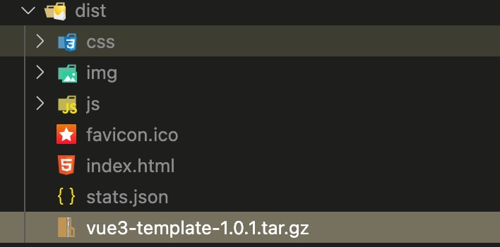

<!--
 * @Description: string
 * @Author: klisit
 * @Date: 2021-04-14 22:47:33
 * @LastEditTime: 2021-04-18 02:45:23
 * @LastEditors: klisit
-->

# 🚀 Welcome to your new awesome project!

# 介绍

**webpack5** 下搭建的 **vue3**+ **sass** + **ts** 项目模版

## 主要脚本配置

- `build` 打包(默认为测试环境打包)
- `build:dev` 测试环境打包
- `build:prod` 生产环境打包
- `build:tar` 压缩打包文件(dist 里的文件---> `[project-name]-[version].tar.gz`)
- `build:clean` 清除打包文件(递归删除 dist)
- `watch` 监视模式启动项目
- `serve` 开发模式启动项目
- `analyzer` 打包文件分析
- `lint:css` css 格式检查
- `fix:css` css 格式修复
- `lint:js` js 格式检查
- `fix:js` js 格式修复
- `ver` 项目版本号设置或输出

## 环境变量

```
# PROJECT OPTIONS
VUE_APP_DIST=dist                              打包输出的文件夹
VUE_APP_NAME=vue3-template                     打包主页title名称
VUE_APP_OUTPUT_NAME=vue3-template              打包完成压缩成压缩包的名称
VUE_APP_VERSION=1.0.1                          项目版本
VUE_APP_ICON=public/favicon.ico                项目icon图标，浏览器tag上显示

### DEV OPTIONS
VUE_APP_DEV_AUTO_OPEN=0                        是否启动自动打开浏览器
VUE_APP_DEV_HOST=127.0.0.1                     运行的ip地址
VUE_APP_DEV_PORT=4396                          运行的端口
VUE_APP_ROUTER_HISTORY=1                       是否是默认路由(1是history模式｜2是hash模式)
```

> **tips**  
> 要添加环境就直接项目根目录添加`.env.[env-name]`  
> 然后在 package.json 里添加命令 `webpack --node-env [env-name]`

## 可有可无的操作

> 以下加入的内容为个人喜好

### 版本戳

对应目录：

- bin/version.js
- src/App.vue

效果如下





### 将打包文件压缩成 tar.gz 包

- bin/archive.js

效果如下



